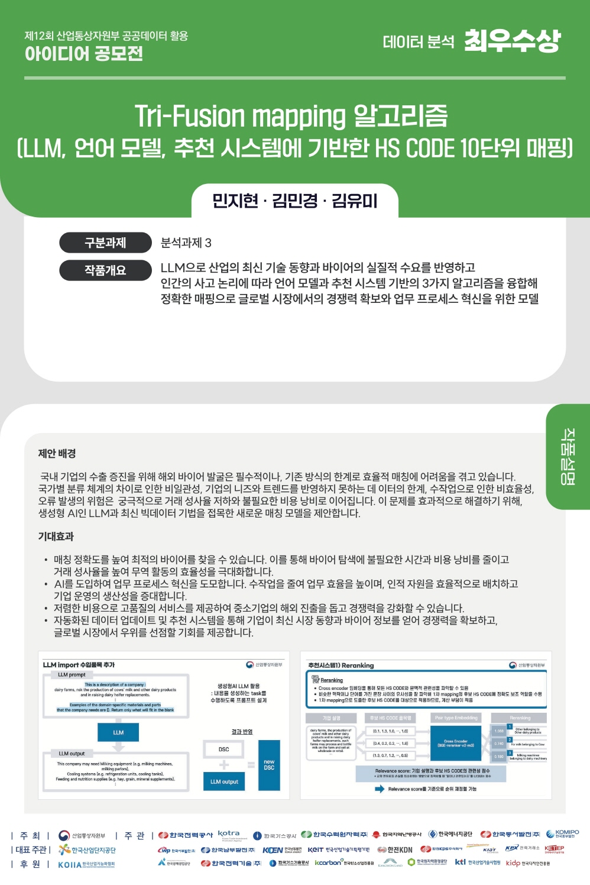

<h4 align='center'> 제12회 산업통상자원부 공공데이터 활용 아이디어 공모전 </h4>

<h1 align='center'> Tri-fusion 매핑 알고리즘 </h1>

&nbsp;

<table>
    <thead>
        <tr>
            <th colspan="4"> 팀 구성원 </th>
        </tr>
    </thead>
    <tbody>
        <tr>
          <tr>
            <td align='center'><a href="https://github.com/mixk0n9"></td>
            <td align='center'><a href="https://github.com/ymk713"></td>
            <td align='center'><a href="https://github.com/Bluemming"></td>
          <tr>
            <td align='center'>김민경</td>
            <td align='center'>김유미</td>
            <td align='center'>민지현</td>
          </tr>
        </tr>
    </tbody>
</table>

&nbsp;  

<h3 align='center'> 🏆 데이터 분석 부문 최우수상 수상 </h3>

<a href="https://www.datacontest.kr/board/view/97533073/8482"> 제12회 산업통상자원부 공공데이터 활용 아이디어 공모전 데이터 분석 수상내역 [2024년]</a>

&nbsp;

## 기간
2024.04.30 - 2024.07.01

&nbsp; 

## 목표
- 인간의 사고 논리를 기반으로 해외 바이어 기업 설명과 수출입 품목 HS코드를 매핑하는 모델 개발
- B2B 마케팅에 유의미한 영향을 주는 요인을 파악하여 솔루션 제시
- 데이터 불균형 문제 해결, 예측 모델 성능 향상

&nbsp;  

## 사용 데이터
- 해외 기업 설명 텍스트(영어)
- HS 코드 품목명 텍스트(한국어)

&nbsp;  

## 분석 방법
- HS 코드 품목명 전처리 : 언어 모델과 수작업으로 영어 번역
- 해외 기업 설명문 전처리 : 기업이 수입할만한 품목을 LLM으로 생성하여 추가, 서비스업 여부 LLM으로 판단
- 두 데이터를 sentence transformer로 임베딩하여 추천군을 제시 후, 3가지 기법 보팅 앙상블(기준 : 가상 답안 정확도)
  1. 코사인 유사도가 높은 경우끼리 매핑
  2. Reranking 추천 시스템
  3. VAE 추천 시스템-기업 설명문에 표현된 제외할 물품을 예외 처리로 필터링

&nbsp;  

## 결과
- 사업적 측면의 니즈를 고려한 LLM 프롬프트 엔지니어링으로 성약 극대화
- 가상 답안 기준 평균 75%의 높은 정확도
- 복잡한 태스크에서 단계별 적용하는 기법의 논리성을 확보하여 솔루션 제시

&nbsp;  

## 분석 상세

